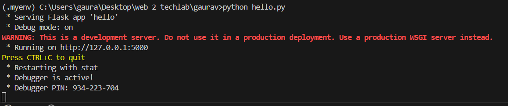

-creation of virtual environment fo python project handling and dependency installment management for each user project.
-Ts is efficent for keeping the dependencies from getting installed in root and messing with other projects

 python -m pip install virtualenv

-virtualenv<env_name>>
-virtualenv .myenv

.myenv\scripts\activate

requirements.txt
pip install flask

Activate venv while working on the project everytime.

